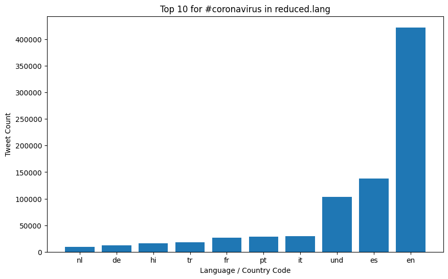
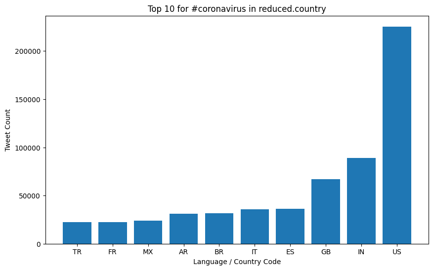
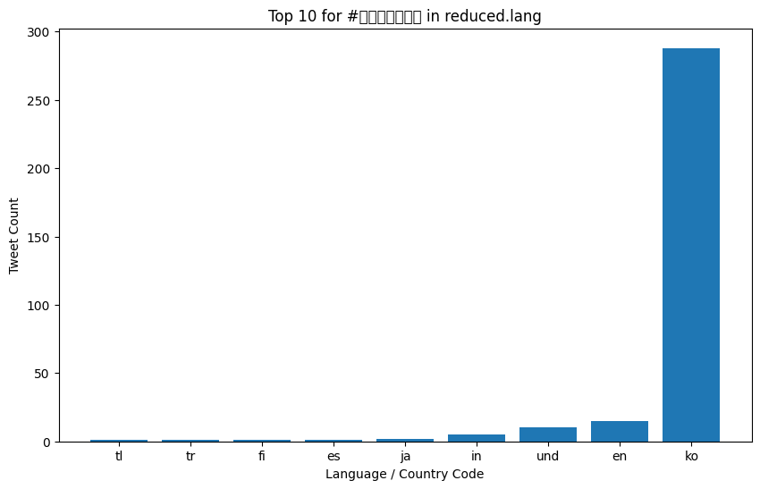
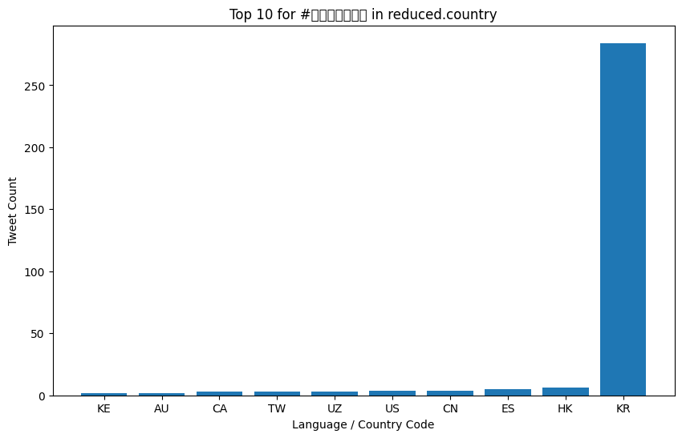
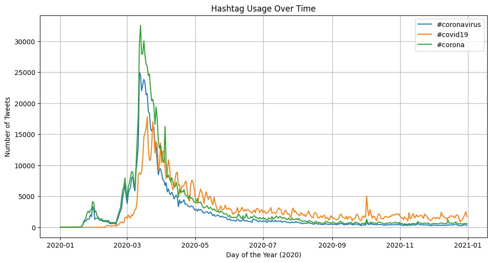
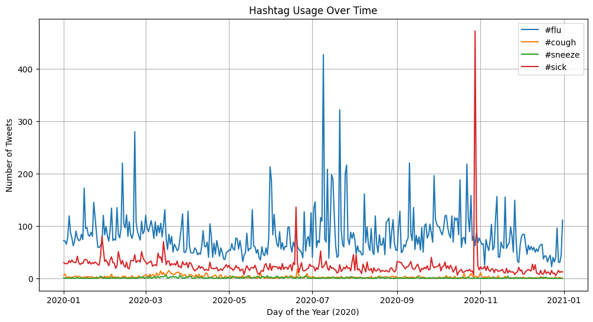

# Coronavirus twitter analysis

## Project Overview
This project analyzes a massive dataset of approximately 1.1 billion geotagged tweets sent in 2020 to monitor the global spread and social media conversation surrounding the COVID-19 pandemic.

By leveraging a **MapReduce** parallel processing architecture on a remote server, the raw JSON tweet data (stored in daily zip files) was efficiently mapped and reduced. The analysis extracts the usage frequency of various virus-related and symptom-related hashtags to track how the pandemic was discussed across different languages and countries throughout the year.

## Technical Skills Demonstrated
* **Large-Scale Data Processing:** Handled over 1 billion JSON records.
* **MapReduce Architecture:** Wrote custom `map.py` and `reduce.py` scripts to divide and conquer the dataset.
* **Parallel Computing:** Used Shell scripting (`run_maps.sh`) and background processes (`nohup`, `&`) to process 366 days of data concurrently.
* **Data Visualization:** Built dynamic Python visualization scripts using `matplotlib` to generate bar charts and time-series line graphs from the reduced output.

## Results & Visualizations

### Language and Country Breakdown (Top 10)
The following bar charts display the top 10 languages and countries where the hashtags `#coronavirus` and `#코로나바이러스` (Korean for coronavirus) were used in 2020.

### Hashtag Usage Over Time
Using an alternative time-series reduction strategy, I tracked the daily usage of specific pandemic-related keywords and symptoms over the course of the year.

**Virus Terminology Timeline:**

**Symptom Tracking Timeline:**

## Additional Background
**About the Data:**

Approximately 500 million tweets are sent everyday.
Of those tweets, about 2% are *geotagged*.
That is, the user's device includes location information about where the tweets were sent from.
In total, there are about 1.1 billion tweets in this dataset.

**About MapReduce:**

Follows the [MapReduce](https://en.wikipedia.org/wiki/MapReduce) procedure to analyze these tweets.
MapReduce is a famous procedure for large scale parallel processing that is widely used in industry.
It is a 3 step procedure summarized in the following image:

Partition step in this case is done by splitting up the tweets into one file per day.

**MapReduce Runtime:**

Let $n$ be the size of the dataset and $p$ be the number of processors used to do the computation.
The simplest and most common scenario is that the map procedure takes time $O(n)$ and the reduce procedure takes time $O(1)$.
(These will be the runtimes of our map/reduce procedures.)
In this case, the overall runtime is $O(n/p + \log p)$.
In the typical case when $p$ is much smaller than $n$,
then the runtime simplifies to $O(n/p)$.
This means that:
1. doubling the amount of data will cause the analysis to take twice as long;
1. doubling the number of processors will cause the analysis to take half as long;
1. if you want to add more data and keep the processing time the same, then you need to add a proportional number of processors.

More complex runtimes are possible.
Merge sort over MapReduce is the classic example.
Here, mapping is equivalent to sorting and so takes time $O(n \log n)$,
and reducing is a call to the `_merge` function that takes time $O(n)$.
But they are both rare in practice and require careful math to describe,
so we will ignore them.
In the merge sort example, it requires $p=n$ processors just to reduce the runtime down to $O(n)$...
that's a lot of additional computing power for very little gain,
and so is impractical.
